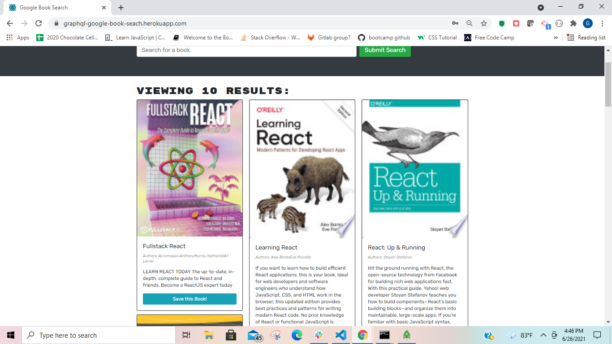
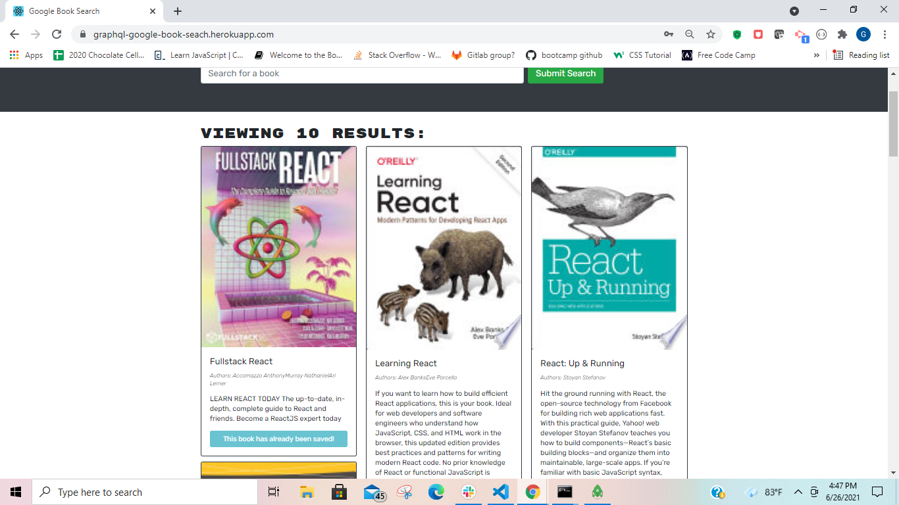
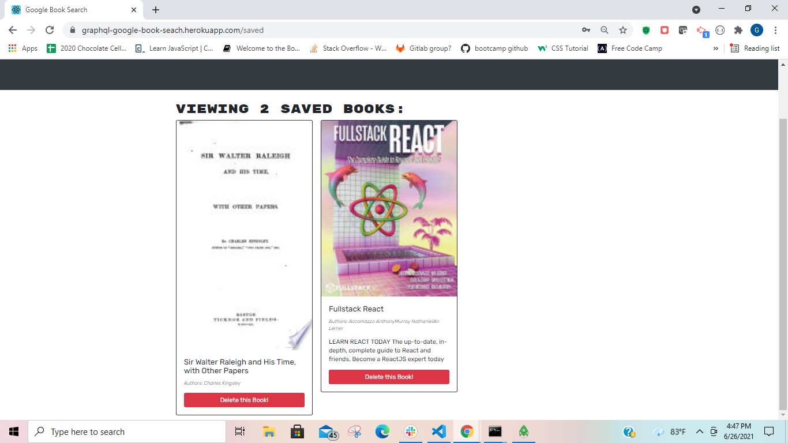
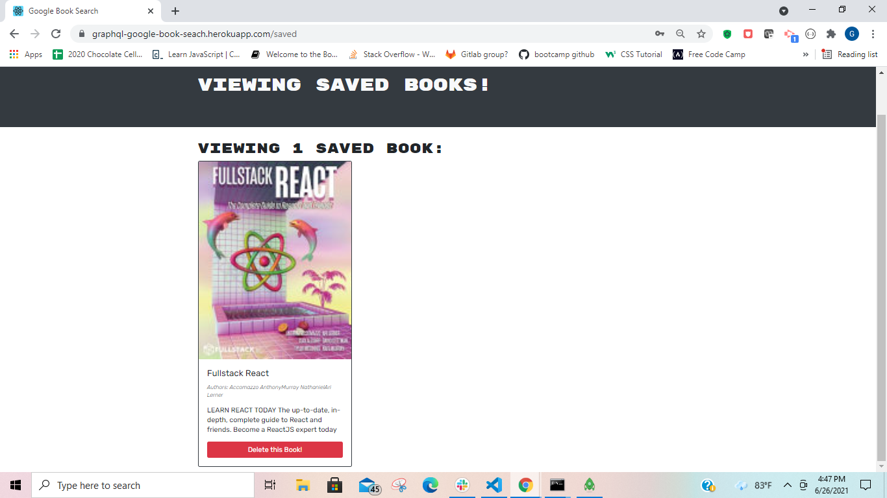

# graphql-book-search-engine


## Description
The Google Book Search Engine is a simple web application built on the MERN Stack that allows users to search for any book that exists on the Google Book Library. Users are also able to save books that they are interested in to their profile so that they can keep track of what books they would like to read.

## Usage
To use the application go to https://graphql-google-book-search.herokuapp.com/ and begin by creating an account (create a username, provide an email, and create a unique password) so that you can access all of the sites features. Once logged in you can search for any book using its title or any keywords that may be in the description. Every book has a "Save this book!" button that saves the the book to your profile so that you can easily keep track of which books you are interested in! Once you have saved a book the "Save this book!" button changes to a "This book has already been saved!" message to prevent you from saving the same book twice. To view your saved books click the "See Your Books" link on the right side of the navigation bar that is located at the top of the web page. When you have found a copy of any of your books to read or you are simply no longer interested in them anymore just click the "Delete this book!" button and it will be removed from your profile. You can logout from the webpage and your books will stay safe and sound where you left them! 






## Installation
If you would like a local version of this application:
1. Run this in a command line at whatever file path you want this program exist at:
```bash
git clone https://github.com/Gpphelps/graphql-book-search-engine
```
2. If you want a development version to personally edit run this command at the root level of the repo in the integrated terminal:
```bash
npm install && npm run develop
```
3. If instead you want a production version for personal use at the root level of the repo run:
```bash
npm install && npm run build
```
4. To save and store data make sure you have a connection to mongooseDB running while using the app locally by executing the following in a command line window:
```bash
mongod
```
You now have a locally hosted version of the graphql-book-search-engine with all of its capabilities!

## Features 
This application features the use of mongoose-atlasDB to store and save books from the Google Book Search API. JSON Web Tokens are used to authenticate users, prevent unauthorized users from accessing cetian features of the site, and making sure that all requests being made on the site are done by legitmate users. The graphql-book-search-engine makes use of GraphQL quereies, mutations, typeDefs, and resolvers to handle all requests made to the mongoose database and the server. 

## Contributing
If you would like to contribute in any way to this project please feel free to post an issue to the Github repository and I will address it as soon as possible.

## license
MIT

## Repository
https://github.com/Gpphelps/graphql-book-search-engine

## Deployed Application
https://graphql-google-book-seach.herokuapp.com/

